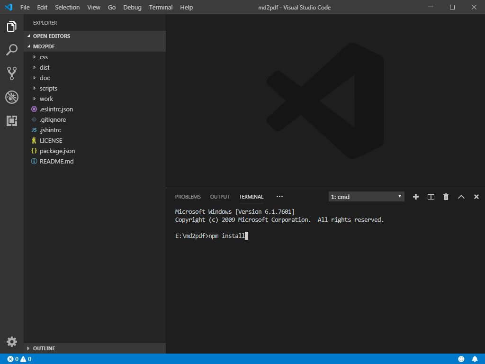
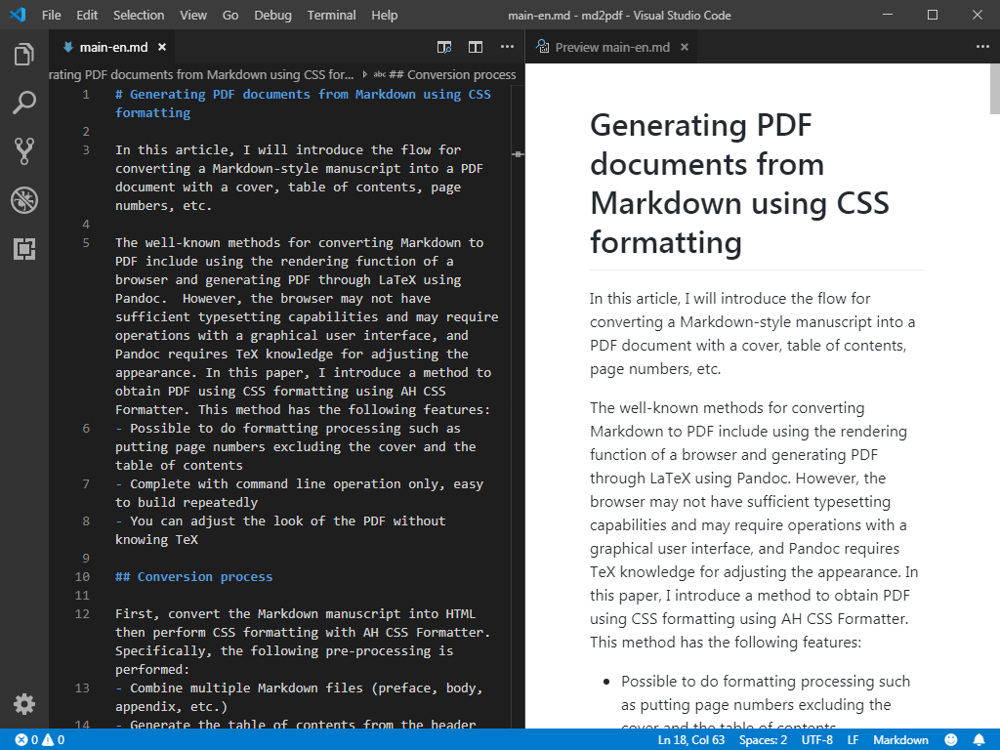

# Generating PDF documents from Markdown using CSS formatting

In this article, I will introduce the work flow for converting a Markdown-style manuscript into a PDF document with a cover, table of contents, page numbers, etc.

The well-known methods for converting Markdown to PDF include using the rendering function of a browser and generating PDF through LaTeX using Pandoc.  However, the browser may have limited typesetting capabilities and may require operations with a graphical user interface, and Pandoc requires TeX knowledge for adjusting the appearance. In this paper, I introduce a method to obtain PDF using CSS formatting using AH CSS Formatter. This method has the following features:
- The formatter may do processing such as putting page numbers except on the cover and the table of contents
- Completely command line operation, making it easy to build repeatedly
- You can adjust the look of the PDF without knowing TeX

## Conversion process

First, convert the Markdown manuscript into HTML then perform CSS formatting with AH CSS Formatter. Specifically, the following pre-processing is performed:

- Combine multiple Markdown files (preface, body, appendix, etc.)
- Generate the table of contents from the header elements of the combined Markdown files.
- Convert Markdown files that contain table of contents to HTML file.
- Add metadata etc. to HTML file.
- Embed images etc. within HTML file.

For those operations against Markdown and HTML, useful JavaScript tools are available as Node.js package. So, this time, the whole process including CSS formatting by AH CSS Formatter can be executed by npm, which is a package management tool for Node.js.

Later on, I will introduce this document itself as an example of the procedure for sequentially executing the above preprocessing and CSS formatting and building a Markdown manuscript into PDF using npm task execution function. I will then briefly explain each step of the build process.

## Generating a PDF from Markdown

You can download the complete set of source files “[md2pdf](https://github.com/2SC1815J/md2pdf)”<span class="Footnote">https://github.com/2SC1815J/md2pdf</span> that were used to create this document and try building a Markdown manuscript into a PDF.

### Operating Environment

The work flow introduced here requires the following environment:

- Node.js 10+
- AH CSS Formatter V6.6 MR5+

Also, although it is not required, it may be useful to have Visual Studio Code (VS Code) as an editing environment. Later on, I will explain how to set up editing and previewing your Markdown original in VS Code, and I will also show you how to make it possible to build the PDF from a single window.

### Set up

Once you have downloaded the complete set of source files, unzip them in an appropriate location.

Next, if you are using VS Code, select “Open Folder” from the “File” menu of VS Code, and open the extracted folder then select “New Terminal” from the “Terminal” menu. If you are not using VS Code, open a terminal (such as Command Prompt in Windows) and move to the extracted folder.

When ready, execute the following command from the terminal. The Node.js packages required for the Markdown to PDF build process will be installed.

```
npm install
```



### Introducing Markdown Preview Github Styling

If you write a Markdown script in VS Code, install the VS Code extension “[Markdown Preview Github Styling](https://marketplace.visualstudio.com/itemdetails?itemName=bierner.markdown-preview-github-styles)”<span class="Footnote">https://marketplace.visualstudio.com/itemdetails?itemName=bierner.markdown-preview-github-styles</span> to preview Markdown with GitHub-style styling, which makes it easier to view conversion results.



### Complex table description

Some parts that cannot be expressed in Markdown are written directly in HTML within the Markdown, as shown in Table 1. (Of course, they will be rendered as tables in the generated PDF, not as HTML).

<table class="page-break-inside-avoid">
<caption>Table 1</caption>
<tr>
  <th rowspan="2">Header 1</th>
  <th colspan="2">Header 2</th>
</tr>
<tr>
  <th>Header 2-1</th>
  <th>Header 2-2</th>
</tr>
<tr>
  <td>&nbsp;</td>
  <td></td>
  <td></td>
</tr>
<tr>
  <td>&nbsp;</td>
  <td></td>
  <td></td>
</tr>
</table>

Prior to AH Formatter V6.6 MR5, the background color of merged cells may not be set correctly.<span class="Footnote">Up to AH Formatter V6.6 MR4, this problem is dealt with by specifying the class explicitly.</span>

### Building PDF

Generate HTML and PDF from the Markdown manuscript in the `doc` folder by executing the following command from the terminal, with output in the `dist` folder.<span class="Footnote">If you are using VS Code, enabling VS Code’s `npm.enableScriptExplorer` setting will allow you to execute a build with a mouse click instead of having to enter a command.</span>

```
npm run build-en
```

The build process executes the steps from `build-en:doc-1` to `build-en:doc-6` described in the `scripts` property of the `package.json` file.  Later on, I will show you the process of converting Markdown documents to PDF in with each of these steps.

## Markdown manuscript to Table of Contents

### `build-en:doc-1` Combining Markdown files

Combines the Table of Contents template (`doc/toc-en.md`) with multiple Markdown manuscripts (`doc/preface-en.md`, `doc/main-en.md`, `doc/appendix-en.md`) into a single Markdown file.

```
npx minicat doc/toc-en.md doc/preface-en.md doc/main-en.md doc/appendix-en.md > work/all-en.md
```

This step generates a temporary Markdown file (`work/all-en.md`).

### `build-en:doc-2` Generating a Table of Contents with DocToc

Generates a Table of Contents using the “[DocToc](https://github.com/thlorenz/doctoc)”<span class="Footnote">https://github.com/thlorenz/doctoc</span> Node.js package. The heading elements contained in the Markdown are extracted, and the Table of Contents is created automatically.

```
npx doctoc --notitle --maxlevel 3 work/all-en.md
```

This step updates the Table of Contents in the temporary Markdown file (`work/all-en.md`).

## Markdown to HTML

### `build-en:doc-3` Conversion with “markdown-it”

Converts Markdown to HTML using the “[markdown-it](https://github.com/markdown-it/markdown-it)”<span class="Footnote">https://github.com/markdown-it/markdown-it</span> Node.js package.<span class="Footnote">Prior to AH Formatter V6.6 MR5, there was a problem that the page number display after CSS formatting did not work correctly if the Markdown heading element contains Japanese, and the URI-encoded Japanese character string is set in the href of the Table of Contents part.</span>

```
node scripts/mdit.js work/all-en.md work/all-en_md.html
```

This step generates a partial HTML file (`work/all-en_md.html`).

### `build-en:doc-4` Adding content not included in the Markdown manuscript

The HTML that “markdown-it” generates does not include `<html>`, `<head>`, `<body>`, links to CSS files, etc. Prepare a template HTML file (`doc/template-en.html`) that describes these separately. The contents of the cover are also described there.

This step includes the HTML generated by “markdown-it” into the template.

```
node scripts/ejs.js doc/template-en.html work/all-en.html
```

In AH Formatter V6.6, when the PDF converted from this HTML is opened in the viewer, the whole pages can be zoomed to fit in the window by including the following description in the meta tag of the HTML file.

```
<meta name="openaction" content="#view=fit">
```

Also, from AH Formatter V6.6 MR5, it is possible to specify the creation date (/CreationDate) and modification date (/ModDate) contained in the document information of the generated PDF by including the following description:<span class="Footnote">Prior to AH Formatter V6.6 MR5, there is a method to set using “[Coherent PDF Command Line Tools (cpdf)](https://community.coherentpdf.com/)”.</span>
```
<meta name="creationdate" content="20190501T090000+09">
<meta name="modifydate" content="20190501T090000+09">
```

The CSS file “[github-markdown-css](https://github.com/sindresorhus/github-markdown-css)”<span class="Footnote">https://github.com/sindresorhus/github-markdown-css</span>  is available to achieve styling like Markdown display on GitHub. (`css/github-markdown.css`)

Write a CSS file (`css/custom.css` or `css/custom-en.css`) for CSS formatting that is ready from the template HTML file, referring to “[Introduction to CSS for Paged Media](https://www.antennahouse.com/antenna1/wp-content/uploads/2019/02/CSS-Print-en-2019-02-15.pdf)”<span class="Footnote">https://www.antennahouse.com/antenna1/wp-content/uploads/2019/02/CSS-Print-en-2019-02-15.pdf</span>.

This step generates a temporary HTML file (`work/all-en.html`).

If you want to adjust the CSS file for CSS formatting, it is better to read this HTML file with the AH Formatter graphical user interface and check the formatting result.

### `build-en:doc-5` Embedding files using “html-inline”

Embed CSS files and image files referenced from HTML files into HTML files using the “[html-inline](https://github.com/substack/html-inline)”<span class="Footnote">https://github.com/substack/html-inline</span> Node.js package.<span class="Footnote">Prior to AH Formatter V6.6 MR6, the location of the source HTML file is displayed in the property "Base URL" of the generated PDF. In order to empty the display, it was necessary to inline external files referenced from the HTML file and specify command line parameters (`-base " "`) when outputting PDF. Starting with AH Formatter V6.6 MR6, this step is no longer required.</span>

```
npx html-inline work/all-en.html -b doc -o dist/all-en.html
```

This step generates an HTML file (`dist/all-en.html`) that contains all the necessary information.

## HTML to PDF

### `build-en:doc-6` Convert using “AHFCmd”

Using  “AHFCmd”, the AH Formatter command line interface, an HTML file containing all the necessary information is styled using CSS and output as a PDF file.

```
AHFCmd -d dist/all-en.html -p @PDF -pdfver 1.5 -base " " -x 4 -pgbar -o dist/all-en.pdf
```

This step generates the final PDF file (`dist/all-en.pdf`).
