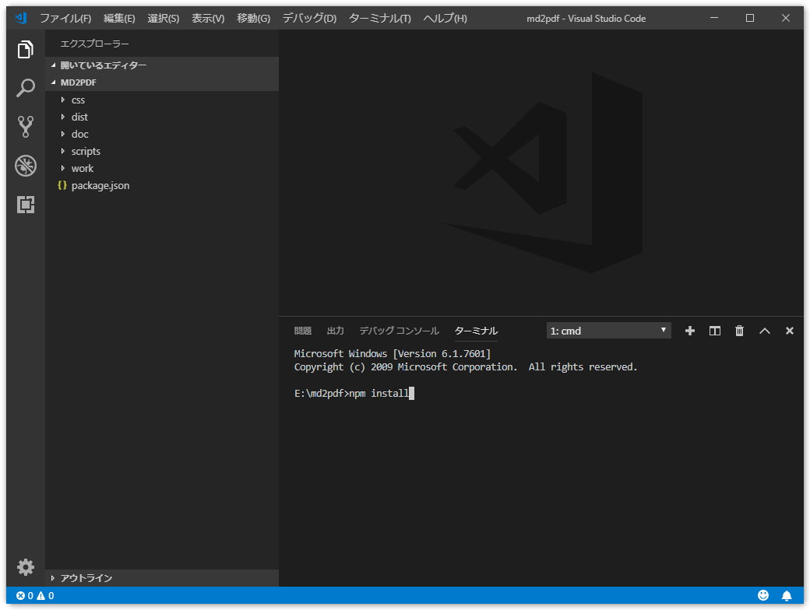
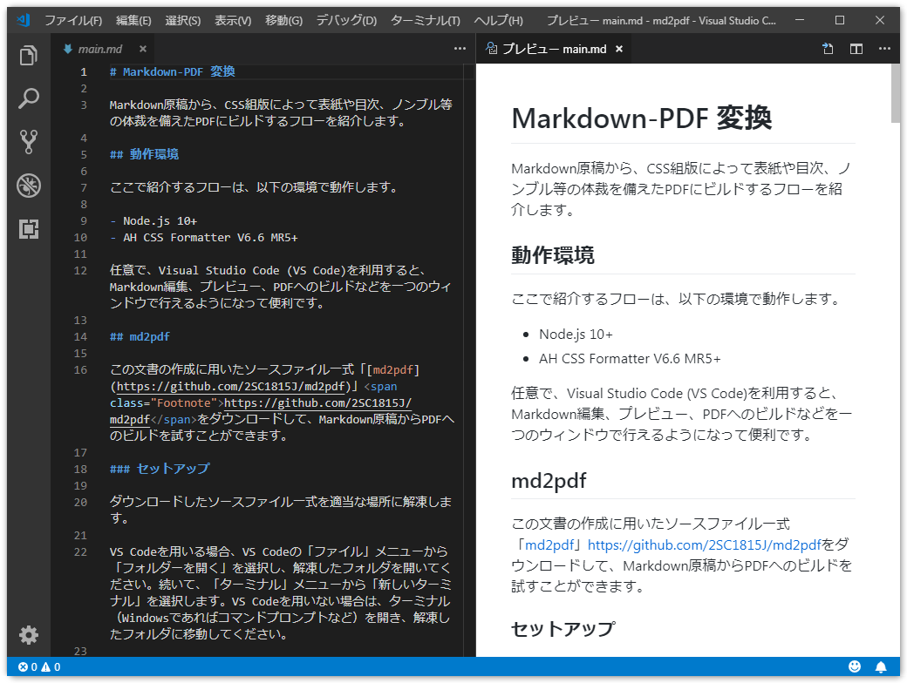

# MarkdownからCSS組版によりPDF文書を生成する

本稿では、Markdown形式の原稿から、表紙や目次、ノンブルなどを備えたPDFの文書へと変換するフローを紹介します。

MarkdownをPDFに変換するフローはいくつか考えられますが、本稿で紹介するフローでは、AH CSS Formatterを利用したCSS組版により以下の点を実現しています。
- コマンドライン操作のみで完結するので繰り返しビルドが容易
- TeXの知識がなくてもPDFの見た目を調整できる

## 変換の方針

AH CSS FormatterによるCSS組版のために、まずはMarkdownの原稿をHTMLへと変換します。具体的には下記のような前処理が必要です。

- Markdownの見出しから目次を生成する
- 複数のMarkdownのファイルを統合し、組版に必要なヘッダ情報などを含む単一のHTMLファイルへと変換する
- 画像などをHTMLファイル中にインライン化して埋め込む
- 組版のためのCSSファイルを用意する

MarkdownやHTMLに対するこれらの操作では、主にウェブ向けに開発されているJavaScript製の便利なツールがNode.jsパッケージとして利用できます。そこで今回は、AH CSS FormatterによるCSS組版を含めた処理全体を、Node.jsのパッケージ管理ツールであるnpmにより実行できるようにしました。

以降では、npmのビルドプロセスを起動してMarkdown原稿からPDFへのビルドを試す手順を、この文書そのものを例に紹介します。その後、npmのビルドプロセスの各手順について、簡単に内容を説明していきます。

## 実際にMarkdownからPDFのビルドを試す

この文書の作成に用いたソースファイル一式「[md2pdf](https://github.com/2SC1815J/md2pdf)」<span class="Footnote">https://github.com/2SC1815J/md2pdf</span>をダウンロードして、Markdown原稿からPDFへのビルドを試すことができます。

### 動作環境

ここで紹介するフローは、以下の環境で動作します。

- Node.js 10+
- AH CSS Formatter V6.6 MR5+

また、必須ではありませんが、執筆作業のための環境としてVisual Studio Code（VS Code）があると便利でしょう。以降では、VS CodeでMarkdown原稿の編集やプレビューを設定する方法や、PDFへのビルドなどを一つのウィンドウでできるようにする方法も説明します。

### セットアップ

ソースファイル一式をダウンロードしたら、適当な場所に解凍してください。

次に、VS Codeを用いる場合には、VS Codeの「ファイル」メニューから「フォルダーを開く」を選択し、解凍したフォルダを開いてください。続いて、「ターミナル」メニューから「新しいターミナル」を選択します。VS Codeを用いない場合は、ターミナル（Windowsであればコマンドプロンプトなど）を開き、解凍したフォルダに移動してください。

準備ができたら、ターミナルから以下のコマンドを実行してください。MarkdownからPDFへビルドするプロセスに必要なNode.jsパッケージがインストールされます。

```
npm install
```



### Markdown Preview Github Stylingの導入

VS CodeでMarkdown原稿を執筆する場合、VS Codeの拡張機能「[Markdown Preview Github Styling](https://marketplace.visualstudio.com/itemdetails?itemName=bierner.markdown-preview-github-styles)」<span class="Footnote">https://marketplace.visualstudio.com/itemdetails?itemName=bierner.markdown-preview-github-styles</span>をインストールすると、MarkdownがGitHub風のスタイリングでプレビュー表示されるようになり、変換結果をイメージしやすくなります。



### 複雑な表の記述

Markdownでは表現力が十分でない部分（セルが結合された表など）は、表1のように、Markdown中にHTMLで直接記述しています（もちろん、生成されたPDF上では、HTMLではなく表として描画されているはずです）。

<table class="page-break-inside-avoid">
<caption>表1</caption>
<tr>
  <th rowspan="2">見出し1</th>
  <th colspan="2">見出し2</th>
</tr>
<tr>
  <th>見出し2-1</th>
  <th>見出し2-2</th>
</tr>
<tr>
  <td>&nbsp;</td>
  <td></td>
  <td></td>
</tr>
<tr>
  <td>&nbsp;</td>
  <td></td>
  <td></td>
</tr>
</table>

なお、AH Formatter V6.6 MR4では、結合されたセルの背景色が正しく設定されないことがありました。この問題はAH Formatter V6.6 MR5で修正されています。<span class="Footnote">AH Formatter V6.6 MR4までの場合、明示的にクラス指定を行うことで対処します。</span>

### PDFのビルド

ターミナルから次のコマンドを実行することで、docフォルダ内のMarkdown原稿からHTMLとPDFが生成され、distフォルダに出力されます。<span class="Footnote">VS Codeを利用している場合は、VS Codeの`npm.enableScriptExplorer`設定を有効にすることで、コマンドを入力しなくてもマウスクリックでビルドを実行できるようになります。</span>

```
npm run build
```

このビルドプロセスは、package.jsonファイルのscriptsプロパティに記載された、`build:doc-1`から`build:doc-6`のステップに従って実行されます。以降では、この各ステップに沿って、Markdown原稿をPDFへと変換するまでの処理内容を見ていきます。

## Markdown原稿から目次を生成

### `build:doc-1` Markdownファイルの連結

目次のひな形（doc/toc.md）を、複数のMarkdown原稿（doc/preface.md, doc/main.md, doc/appendix.md）と合わせて、単一のMarkdownファイルにします。

```
npx minicat doc/preface.md doc/toc.md doc/main.md doc/appendix.md > work/all.md
```

このステップによって、仮Markdownファイル（work/all.md）が生成されます。

### `build:doc-2` DocTocによる目次生成

Node.jsパッケージ「[DocToc](https://github.com/thlorenz/doctoc)」<span class="Footnote">https://github.com/thlorenz/doctoc</span>を用いて、目次を生成します。Markdownに記述された見出し要素が抽出され、目次が自動的に作成されます。

```
npx doctoc --notitle --maxlevel 3 work/all.md
```

このステップによって、仮Markdownファイル（work/all.md）の目次が更新されます。

## MarkdownからHTMLへ変換

### `build:doc-3` markdown-itによる変換

Node.jsパッケージ「[markdown-it](https://github.com/markdown-it/markdown-it)」<span class="Footnote">https://github.com/markdown-it/markdown-it</span>を用いて、MarkdownからHTMLへ変換します。

```
node scripts/mdit.js work/all.md work/all_md.html
```

Markdownの見出し要素を日本語で記述しており、目次部分のhrefにURIエンコードされた日本語文字列が設定されている場合、AH Formatter V6.6 MR4では、CSS組版によるページ番号表示（target-counter(attr(href))の処理）が正しく動作しない問題がありましたが、AH Formatter V6.6 MR5で修正されました。<span class="Footnote">AH Formatter V6.6 MR4までの場合、Markdownの見出し要素からアンカーを作成するNode.jsパッケージ「[anchor-markdown-header](https://github.com/thlorenz/anchor-markdown-header)」に変更を加えて対処する方法があります。</span>

このステップによって、部分的なHTMLファイル（work/all_md.html）が生成されます。

### `build:doc-4` Markdown原稿に含まれない内容を付与

markdown-itが生成するHTMLには、&lt;html&gt;や&lt;head&gt;、&lt;body&gt;、CSSファイルへのリンクなどは含まれていません。これらを記述したテンプレートHTMLファイル（doc/template.html）を別途用意し、markdown-itによって生成されたHTMLがその中に含まれるようにします。今回は表紙の内容もここに記述しました。

```
node scripts/ejs.js doc/template.html work/all.html
```

AH Formatter V6.6では、HTMLファイルのmetaタグに次の記載を含めることで、このHTMLから変換されたPDFをビューワで開いたときにページ全体がウィンドウに収まっている状態にズームさせることができます。
```
<meta name="openaction" content="#view=fit">
```

また、AH Formatter V6.6 MR5からは、次の記載を含めることで、生成されるPDFの文書情報に含まれる作成日（/CreationDate）と更新日（/ModDate）を指定の値に設定することができます。<span class="Footnote">AH Formatter V6.6 MR4までの場合、「[Coherent PDF Command Line Tools (cpdf)](https://community.coherentpdf.com/)」を利用して設定する方法があります。</span>
```
<meta name="creationdate" content="20190501T090000+09">
<meta name="modifydate" content="20190501T090000+09">
```

GitHubでのMarkdown表示のようなスタイリングを実現するには、CSSファイル「[github-markdown-css](https://github.com/sindresorhus/github-markdown-css)」<span class="Footnote">https://github.com/sindresorhus/github-markdown-css</span>が利用できます（css/github-markdown.css）。

CSS組版用のCSSファイル（css/custom.css）を、「[CSSページ組版入門](https://www.antenna.co.jp/AHF/ahf_publication/index.html#CSSPrint)」<span class="Footnote">https://www.antenna.co.jp/AHF/ahf_publication/index.html#CSSPrint</span>などを参考にして記述し、テンプレートHTMLファイルから読み込まれるようにしておきます。

このステップによって、仮HTMLファイル（work/all.html）が生成されます。

CSS組版用のCSSファイルを調整する場合は、このHTMLファイルをAH Formatterのグラフィカルユーザインターフェイスで読み込み、組版結果を確認しながら行うと良いでしょう。

### `build:doc-5` html-inlineによるインライン化

Node.jsパッケージ「[html-inline](https://github.com/substack/html-inline)」<span class="Footnote">https://github.com/substack/html-inline</span>を用いて、HTMLファイルから参照されているCSSファイルや画像ファイルをHTMLファイル内にインライン化（埋め込み）します。<span class="Footnote">AH Formatter V6.6 MR5までの場合、生成されるPDFのプロパティ「ベースURL」に生成元HTMLファイルの場所が表示され、同表示を空にするには、HTMLファイルから参照されている外部ファイルをインライン化した上で、PDF出力時にコマンドラインパラメータ指定（-base " "）を行う必要がありました。AH Formatter V6.6 MR6からは、これらの処理は不要となっています。</span>

```
npx html-inline work/all.html -b doc -o dist/all.html
```

このステップによって、必要な情報が全て含まれたHTMLファイル（dist/all.html）が生成されます。

## HTMLからPDFへ変換

### `build:doc-6` AHFCmdによる変換

AH FormatterのコマンドラインインターフェイスAHFCmdを用いて、必要な情報が全て含まれたHTMLファイルをCSS組版し、PDFファイルとして出力します。

```
AHFCmd -d dist/all.html -p @PDF -pdfver 1.5 -base " " -x 4 -pgbar -o dist/all.pdf
```

このステップによって、最終的なPDFファイル（dist/all.pdf）が生成されます。
